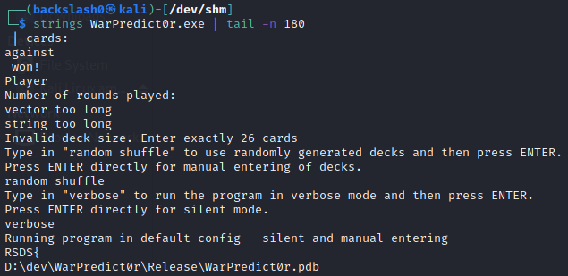

# 1. Antivirus Scanning
A good first step when analyzing possible malware is to scan it with multiple antivirus programs, which may already have identified the malicious code. However, AV tools are not perfect. The are reliant on a database which contains *file signatures* - identifiable pieces of known malicious code, and on *heuristics* - the analysis of behaviour combined with pattern-matching. Rare and modified malware can easily evade AV detection simply because it is not contained its database.

One should run several different antivirus programs against the prospoctive malicious code, since different AVs use different signatures and heuristics. As such, websites like [VirusTotal](https://www.virustotal.com/) can prove very useful in these situations - they allow you to upload files to be scanned by multiple antivirus engines.

# 2. Hashing
Hashing is a method commonly used for uniquely identifying malware. It can serve as a sort of *fingerprint* for the malicious code. The Message-Digest Algorithm 5 (MD5) is often used for this purpose, however, the Secure Hash Algorithm 1 (SHA-1) is also popular.

On Windows, one can generate such a hash by using `CertUtil`:

On Linux, the `md5sum` command is usually available:

Once you have a unique hash for some malware, you can use it in the following ways:
- using the hash as a label
- sharing the hash with other analysts to help them identify the malware
- look up the hash online to see if it has been previously identified

*It is recommended to use `sha256sum` when you identify malware because md5sum is vulnerable to collision attacks.*

# 3. Finding Strings
A *string* is a sequence of characters. A program may contain many different strings - printing a message, connecting to URLs, accessing file locations, etc. Searching through the strings in a program can give hints about its functionality.  If a program creates or modifies a specific file, you will be able to see the string of the file location in the program. The [Strings](https://docs.microsoft.com/en-us/sysinternals/downloads/strings) command can be used to seach a binary for strings that are usually stored in ASCII or Unicode format:

*Note: I haven't used actual malicious code, but instead a little program that I created.*