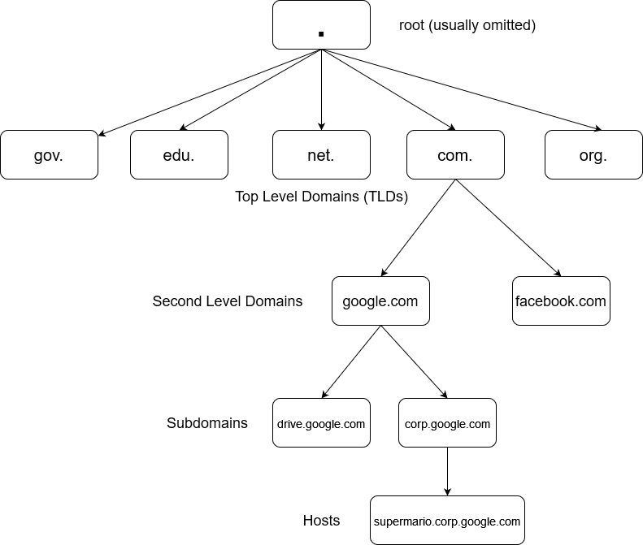

# Introduction
Computers connected to the Internet have a numerical identifier - called an Internet Protocol Address (IP Address) - which is used to communicate with this machine. However, remembering a 32-bit number for each computer you want to connect to - even if it's formatted nicely into four separate sections - isn't practical at all. As such, a systematic way of resolving this issue was a created - a sort of lookup table for IP addresses, known as the Domain Name System.

# What is the DNS?
The Domain Name System (or DNS for short) is a decentrialised database which provides answers to queries for *domain names*. Such a query is for example "What is the IP address of google.com? " When such a request is sent out, it will go through the DNS and eventually return with an IP address (if such was found). This saves the average user from having to remember a myriad different IPs for each website they want to visit.

# The DNS Hierarchy
The DNS utilises a hierarchical structure for both storing and serving requested information.

