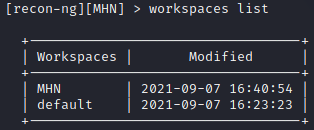

# What is recon-ng?
Recon-ng is a powerful open-source framework for conducting OSINT. It is available at https://github.com/lanmaster53/recon-ng

# Setup
recon-ng comes pre-installed with Kali, but can be downloaded on Debian-based distros through the `apt` package manager.

```bash
sudo apt install recon-ng
```

For many of the modules you will need to add API keys. More on that you can read [here](https://github.com/lanmaster53/recon-ng-marketplace/wiki/API-Keys).

You will need to install any modules before using them. You can install all modules with the following command inside recon-ng:

```bash
marketplace install all
```

```bash
[recon-ng][default] > marketplace install all
[*] Module installed: discovery/info_disclosure/cache_snoop
[*] Module installed: discovery/info_disclosure/interesting_files
[*] Module installed: exploitation/injection/command_injector
[*] Module installed: exploitation/injection/xpath_bruter
[*] Module installed: import/csv_file
[*] Module installed: import/list
[*] Module installed: import/masscan
[*] Module installed: import/nmap
--snip--
[*] Reloading modules...
```

You will also see errors for any API keys you haven't set up yet:

```bash
[!] 'github_api' key not set. github_commits module will likely fail at runtime. See 'keys add'.
[!] Module 'recon/netblocks-companies/censys_netblock_company' disabled. Dependency required: ''censys''.
[!] 'whoxy_api' key not set. whoxy_whois module will likely fail at runtime. See 'keys add'.
[!] Module 'recon/domains-companies/censys_companies' disabled. Dependency required: ''censys''.
[!] 'bing_api' key not set. bing_linkedin_contacts module will likely fail at runtime. See 'keys add'.
[!] 'github_api' key not set. github_users module will likely fail at runtime. See 'keys add'.
[!] Module 'recon/hosts-hosts/censys_hostname' disabled. Dependency required: ''censys''.
[!] Module 'recon/hosts-hosts/censys_ip' disabled. Dependency required: ''censys''.
[!] 'ipinfodb_api' key not set. ipinfodb module will likely fail at runtime. See 'keys add'.
--snip--
```

# Workflow
1. Workspaces - recon-ng organises gathered information into workspaces, which are managed with the `workspaces` command.
	- create a workspace:
		```bash
		workspaces create [name]
		```
		```bash
		[recon-ng][default] > workspaces create MHN
		[recon-ng][MHN] >
		```
	- list all workspaces:
		```bash
		worspaces list
		```

		

