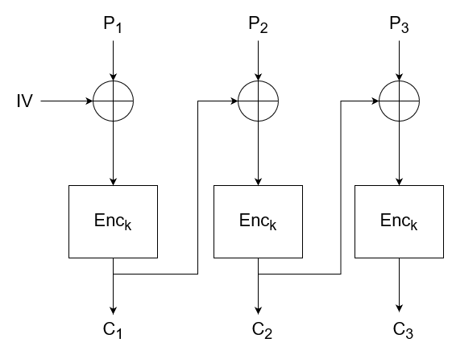
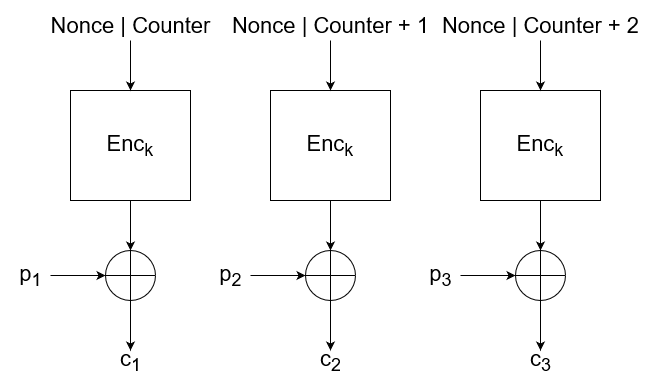

# Introduction
It's all well and good with block ciphers when encrypting messages whose length matches the block size, but what happens if we want to encrypt a plaintext that is longer than a single block? Well, here comes the use of a *mode of operation*. If the message is longer than the block size, then it must be split into blocks of the desired size. From then on, the mode of operation describes how each of the blocks is encrypted and how the resulting ciphertexts are combined into the final output.

# The Electronic Codebook (ECB) Mode
This is the simplest mode of operation you could think of. It encrypts each plaintext block independently and then just concatenates the resulting ciphertexts. 

This mode is abominably insecure, since it is *pattern preserving*. While patterns inside each block are destroyed (a proper encryption algorithm should take care of that), patterns between blocks are ultimately preserved. To illustrate, let's say that you want to encrypt the number 19281267. If you have 4-bit blocks, you would encrypt the blocks 1928 and 1267. Suppose, that these get encrypted to 4765 and 4104. If you check, subtracting the second plaintext block from the first yields the same result as subtracting the second ciphertext from the first, namely 661. An infamous example of this is the ECB penguin. Encrypting an image with ECB will yield the same image with merely a distorted colour scheme.

# The Cipher Block Chaining (CBC) Mode
Cipher block chaining resembles ECB, but it actually incorporates the previous block into the encryption of the current one. Instead of encrypting the $i$th block $p_i$ as $c_i = Enc_k(p_i)$, cipher block chaining XORs the plaintext with the previous ciphertext: $c_i = Enc_k(p_i \bigoplus c_{i-1})$. The first plaintext is XOR-ed with a random value called an *initialisation vector (IV)*.

Since each consecutive block depends on the previous one, patterns between blocks are destroyed. Furthermore, if the IV is different each time, two identical plaintexts will produce disparate ciphertexts when encrypted. Note, that for decryption, the IV needs to be known. It is also interesting to mention that CBC decryption can be much faster than encryption due to parallelism. When encrypting, each new block needs to wait for the previous one to be encrypted in order to get its ciphertext, however, with decryption all ciphertexts are already known, so it can optimised on multiple threads.

# The Counter (CTR) Mode
The Counter mode is a bit different to the ones described above. It turns a block cipher into a stream cipher - in fact, it doesn't even encrypt the blocks themselves! 
This mode is comprised of an IV, often in this case called a *nonce*, and a counter. The counter may be any function which is guaranteed to generate a sequence which will not repeat for a long time. That being said, it is still very common to just use a simple increment-by-one counter. 

The way that the CTR mode works is by taking the nonce and the counter for the current block (the counter is incremented for each block) and combining them together. If the nonce is random, it may be combined with the counter by means of any invertible operation such as addition, concatenation, or XOR-ing. Should that not be the case, then the nonce and the counter should be concatenated, since simply adding or XOR-ing them would break the security under a chosen plaintext attack, since an attacker may be able to manipulate the entire nonce–counter pair to cause a collision. Once they have control over the nonce-counter pair and plaintext, XOR-ing the ciphertext with the plaintext would produce a value that can be XOR-ed with the other block sharing the same nonce-counter pair in order to decrypt it.

After this, the nonce-counter pair is encrypted with the key and then XOR-ed with the plaintext block in order to produce the ciphertext.

It is paramount that the nonce is unique between messages, since when encrypting two plaintexts with the same nonce-counter stream - $c_1 = p_1 \bigoplus S$ and $c_2 = p_2 \bigoplus S$, then $c_1 \bigoplus c_2$ reveals $p_1 \bigoplus p_2$.

Furthermore, a random nonce is sufficient only if it is long enough. Given a nonce of length $n$ bits, it is likely that after $2^{n/2}$ encryptions collisions will start occuring. Therefore, a 64-bit nonce is abominable due to the fact that collisions will commence after approximately $2^{32}$ encryptions, which is a very low number. 

Decryption works by XOR-ing the ciphertext with the appropriate nonce-counter pair.

A particular benefit of the CTR mode is that it is parallelisable and can thus execute rather quickly. You can even begin encryption before having the message to encrypt by selecting a nonce and computing the nonce-counter stream which will be later XOR-ed with the plaintext.