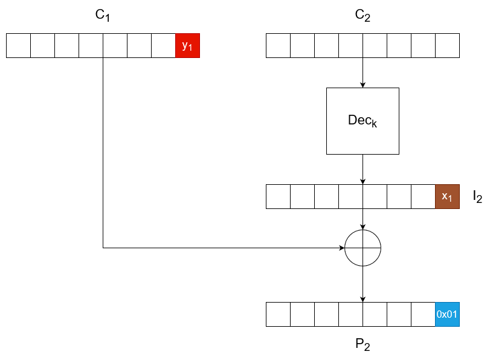
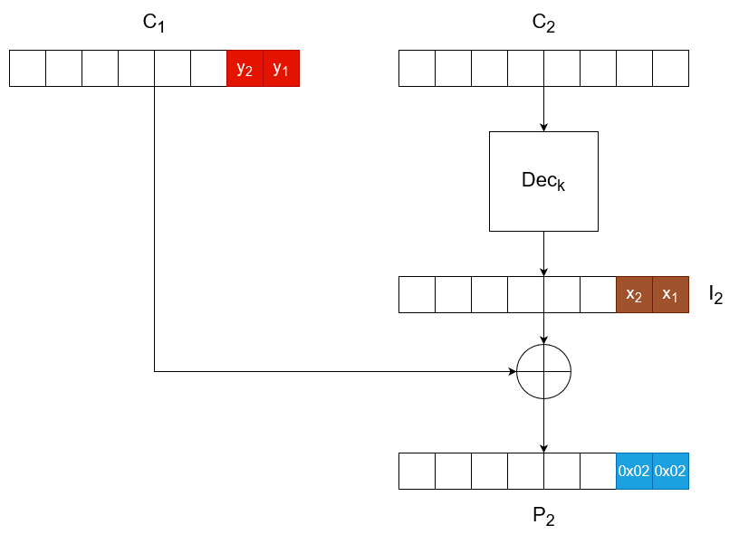

# Introduction
A padding oracle attack which abuses padding validation information in order to decrypt an arbitrary message. In order to achieve, it requires a *padding oracle*. A padding oracle is any system which, given a ciphertext, behaves differently depending on whether the decrypted plaintext has valid padding or not. For the sake of simplicity, you can think of it as a sending an arbitrary ciphertext to a server and it returning "Success" when the corresponding plaintext has valid padding, and spitting out "Failure" otherwise. Note that the ciphertexts you query the oracle with need not have meaningful plaintexts behind them and you will not even be generating them by encryption, but rather crafting them in a custom manner in order to exploit the information from the oracle.

# How It Works
Let's remind ourselves of how CBC decryption works by taking a simplified look at the last two blocks:

The last ciphertext $C_2$ is decrypted with the key $k$ to an intermediate block $I_2$. This intermediate state is then XOR-ed with the penultimate ciphertext block, $C_1$, in order to retrieve the plaintext block $P_2$. Note, all block here are made from bytes.

Now, let's imagine a second scenario, where $C_2$ is kept the same, be we purposefully alter the last byte of $C_1$. After this modification, we send the ciphertext to the oracle. Our goal here is to obtain a "success" from it, meaning that it has managed to decrypt the ciphertext we sent it to a plaintext with a valid padding. Since we are only altering the last byte for now, we want to generate a ciphertext which when decrypted will result in a plaintext, whose last byte is `0x01`.

Since, we didn't change $C_2$, the intermediate $x_1$ also remains the same. Additionally, $y_1$ is a single byte so it can only take a total of 256 values. This makes it rather easy to bruteforce what $y_1$ should be, simply by sending queries at max 256 queries to the oracle. Once the oracle returns a "Success", we have found the right value for $y_1$. We can now simply XOR $y_1$ with `0x01` to obtain the value of $x_1$, $x_1 = y_1 \bigoplus \text{0x01}$. 

Since $x_1$ is the same in both the original and the attack scenario, we can now XOR $x_1$ with the original last byte of $C_1$ in order to obtain the last byte of the original plaintext! This procedure can be further repeated to obtain the penultimate byte, then the antepenultimate byte and so forth! All that is needed is to find the two bytes at the end of $C_1$ that would result in a plaintext ending in `0x0202`.

We already know $x_1$, so we can obtain the new $y_1 = x_1 \bigoplus \text{0x02}$. We now only need to bruteforce $y_2$ with the same technique described above. Once the oracle returns a "Success", we have found the correct value for $y_2$ and can obtain $x_2 = y_2 \bigoplus \text{0x02}$. Going back to the original scenario, we compute the penultimate byte of the plaintext by XOR-ing the penultimate byte of the unaltered $C_1$ with the value of $x_2$. Rinse and repeat and you have decrypted the entire plaintext! Note, you will have to reset the procedure from `0x01` with each new block.

# Example
