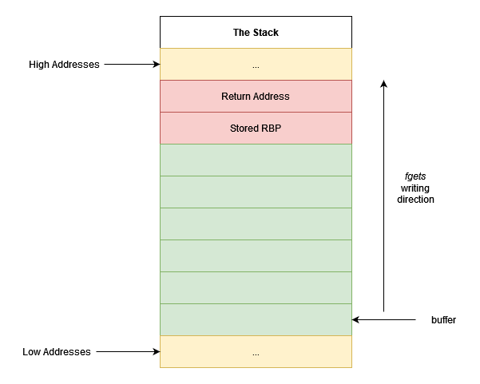
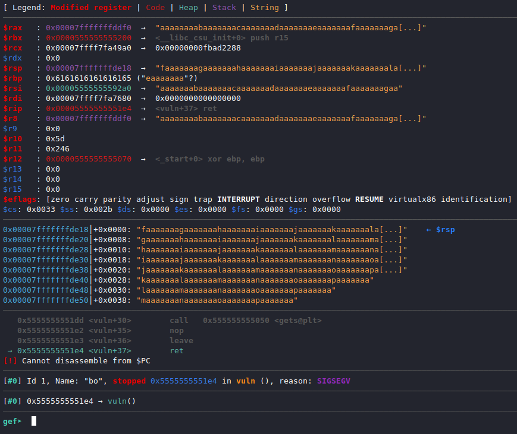

# Introduction
An essential memory structure in many programmes is the buffer. It is simply a container for information - an array. This in itself is no threat to the programme, however, certain functions which deal with buffers are unsafe. Functions that write to buffers may *overflow* the buffer - that is, write to memory outside of the buffer, since the function usually doesn't have a way to infer the size of the buffer and therefore stop once it reaches it. Moreover, even a function is provided with a size up to which to write and then cease execution, this can still result in a buffer overflow, if there is a mismatch between the given and actual size of the buffer.

Buffer overflows are one of the most common vulnerabilities and can be especially dangerous if they happen on the stack, since they typically allow for easy code execution. This happens when writing otuside the buffer and overwriting the procedure's return address.

Generally, any function which deals with buffers should be considered unsafe and scrutinised when looking for holes in a binary. That being said, there are certain functions which are appalling and you should *never* use them in your code, since they don't even take in a buffer size, but rather just do their work indefinitely or until some condition is satisfied (such as reaching a null-byte). These include `gets`, `strcpy`, `strcat`, `sprintf`, and more.

# Exploiting a Buffer Overflow
```cpp
#include <stdio.h>

void win()
{
	printf("Pwned!\n");
}

void vuln()
{
	char buffer[32];
	fgets(&buffer, 0x32, stdin);
}

int main()
{
	vuln();
}
```

To illustrate that even functions which take a size can still be dangerous when dealing with buffers, I have chosen the `fgets` function. If you don't have an attentive eye, you might tell yourself "But wha'ts the matter? The size which `fgets` takes matches the actual size of the buffer, so no vulnerability here." Not so fast. Upon taking a closer look, you see that the size in `fgets` is actually `0x32`. The `0x` means that this is a hexadecimal number and `0x32` in hex is actually equal to `50` in decimal which is 18 bytes more that 32. Consequently, there is a buffer overflow.



`fgets` begins writing data at the start of the buffer and continues upwards. Given enough data to write, it will eventually reach and overwrite the return address, resulting in code execution when the `vuln` function returns. We now need two things to exploit the vulnerability - the address of the `win` function, which is fairly easy to get given disabled ASLR and `gdb`, and the offset from the beginning of the buffer at which `vuln`'s return address is stored. Note that this is rarely just the size of the buffer, since other stuff may precede our buffer on the stack.

## Using De Brujin sequences to identify the offset
A De Brujin sequence of order `n` is simply a sequence of characters in which every possible substring of size `n` occurs exactly once. A more mathematically rigorous explaination you can find at https://en.wikipedia.org/wiki/De_Bruijn_sequence.

De Brujin sequences are very powerful, since we can generate such a string and pass it as input to the programme. When the return address is overwritten, it will contain garbage (the sequence of characters inside of it may look like `aaaaaaab`, which is most likely an invalid return location) and so the programme will crash. Once it crashes, we can inspect the return address with a debugger and look up its position in the original sequence. This, therefore, provides us with the offset.

`gef`, a `gdb` extension, provides useful tools exactly for this purpose. You can generate a pattern with 
`pattern create --period [order] [length]`


Pass this sequence as input to the programme and observe the return address when it crashes:



Look at what `$rsp` points to - `faaaaaaagaaaaaaahaaaaaaaiaaaaaaajaaaaaaakaaaaaaala`. We can search for this string in the original pattern like so:


Bingo, the return address is stored at offset `40 - 1` from the beginning of `buffer`. Ergo, before writing the address of `win`, 39 characters are needed. You might notice that this is according to big-endian search, but my architecture is actually little-endian. Why does this work then? Honestly, I have no clue. Perhaps it's a visual bug with `gef`, since if you look at their documentation, `pattern search` is actually supposed to output two outputs - one for a little-endian and one for a big-endian search.

## Finding the address of `win`
For the sake of simplicity, I have disabled ASLR, meaning we can just grab the address through `gdb`. This turns out to be `0x5555555551a9`.

## Exploit
With this information, we can exploit the buffer overflow:

