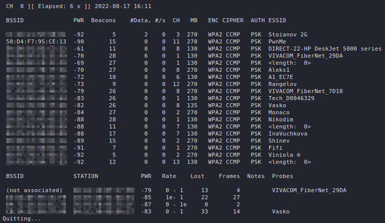

# Introduction
WiFi has become an integral part of our lives, however it can be hacked rather easily if you do not have a strong password.

Before proceeding, you will need a wireless adapter which supports [monitor mode and packet injection](https://deviwiki.com/wiki/List_of_Wireless_Adapters_That_Support_Monitor_Mode_and_Packet_Injection).

When connecting a device to a WiFi network, the device and the access point go through the process of a *4-way handshake*. During this time, the hash of the password is broadcasted and if we can capture this hash, we can also attempt to crack it.

# Capturing the Handshake
You will first need to put your adapter into monitor mode with the following command:
```
sudo airmon-ng start <dev>
```

You can get a list of devices with `ip a`.


Next, you should listen for the available access points by using
```
sudo airodump-ng <dev>
```



Once you have identified the network you want to attack, you can make `airodump` specifically listening for it by providing a MAC address (`--bssid`) and a channel (`-c`). You will also want to write the capture to a file, so that it may later be cracked with `aircrack-ng`:


Now, `airodump` is listening for the specified access point. Under the `STATION` tab, you can see all devices which are connected to the network. 

You now have to wait for someone new to connect to the target network or to reconnect in order to capture the handshake. If you are too impatient, however, there is a way to speed this process up. You can use `aireplay-ng` to disconnect a device already connected to the network. Since most devices are configured to look for and automatically connect to saved networks, the disconnected device is likely to attempt to connect to the network, establishing a 4-way handshake without any user interaction. The syntax for `aireplay-ng` is the following:

```
aireplay-ng --deauth <count> -a <access point> -c <client> -D <dev>
```

- `--deauth` specifies the amount of deauth frames to send.
- `-a` is the MAC address (BSSID) of the network you want to attack.
- `-c` is the MAC address (BSSID) of the device you want to disconnect from the network. If this is not specified, `aireplay` will disconnect all devices connected to the network.
- `-D` will ensure that the deauth packets are forcibly sent. The attack may not work if this option is not specified, since `aireplay` will look for the target network in all channels and may not find it in time.
- `<dev>` is the wireless adapter you wish to use for the attack.


If the target is not disconnected on the first try, you can always send more deauthentication frames! In this case, however, the deauth was successful and the device automatically reconnected to the network, giving us the handshake:


You can now use `aircrack` to crack the hash:
```
aircrack-ng <capture> -w <wordlist>
```


Boom! We successfully cracked the very difficult-to-guess password of... `password`.