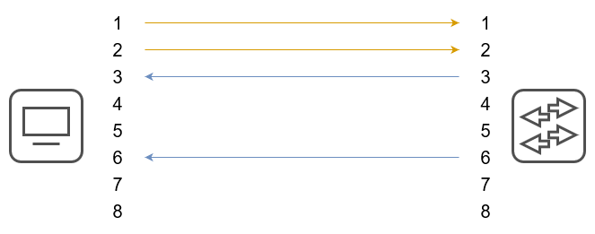
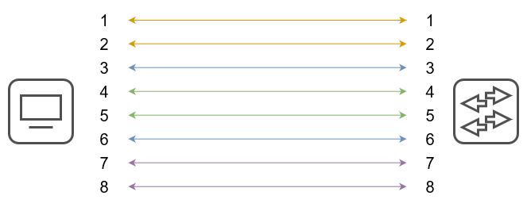

# Introduction
The Physical layer is the lowest layer in the OSI model. It provides the electrical, mechanical, or electromagnetic means by which data is physically transferred between hosts. At the core of the Physical layer lie interfaces and mediums. Interfaces are what allow devices to send receive data, while mediums are what the data travels through between interfaces. Data at the physical layer is transmitted in *bits*, not bytes, hence why internet speeds are typically measured in multiples of bits per seconds or bps.

# Mediums
## Copper (UTP) Cables
The following standards are defined for copper cable Ethernet:

|Speed|Common Name|IEEE Standard|Informal Name|Max Length|
|:-----:|:---------------:|:-------------:|:--------------:|:------------:|
| 10 Mbps| Ethernet | 802.3i | 10BASE-T| 100m |
| 100 Mbps| Fast Ethernet | 802.3u | 100BASE-T| 100m |
| 1 Gbps| Gigabit Ethernet | 802.3ab | 1000BASE-T| 100m |
| 10 Gbps| 10 Gig Ethernet | 802.3an | 10GBASE-T| 100m |

In the above nomenclature, `BASE` refers to baseband signaling, while `T` indicates *twisted pair*.

The copper cables described by the above standards are *Unshielded Twisted Pair* (UTP) cables which comprise 4 pairs of 8 wires.

"Unshielded" means that the wires lack a metallic shield which increases their susceptibility to electrical interference. The "twisted pair" part is pretty self-explanatory and serves the purpose of reducing electromagnetic interference.

The RJ-45 jacks used for Ethernet have 8 pins - one pin per wire - however, not all pins are in use by all standards. 10BASE-T and 100BASE-T avail themselves only of pins 1, 2, 3, and 6. Moreover, different devices use these pins differently. Switches utilise pins 3 and 6 for *transmitting* (Tx) data and use pins 1 and 2 for *receiving* (Rx) data. This separation allows for *full-duplex* transmission - the device is able to both receive and send data at the same time. Most other devices, however, such as PCs, routers, and firewalls do the opposite - they use pins 3 and 6 for receiving and use pins 1 and 2 for sending data.

The above is a diagram of a *straight-through cable*, since there is a one-to-one correspondence between the pins. This is a simple approach, but unfortunately only works when devices of opposite types are being connected - you can't use it to connect a router to another router, a switch to another switch, or a PC to another PC. This is where *crossover cables* come. In these cables, different pins on one end correspond to different pins on the other.

|Device Type|Tx Pins|Rx Pins|
|:-----------:|:-----:|:------:|
|Router|1 and 2|3 and 6|
|Firewall|1 and 2|3 and 6|
|PC|1 and 2|3 and 6|
|Switch|3 and 6|1 and 2|

Most modern devices, however, support a feature called Auto MDI-X. This allows them to detect which pins their neighbour is transmitting data on and automatically adjust their own use of Tx and Rx pins to allow for proper communication. This makes the use of different types of cables often obsolete.

Higher speed standards avail themselves of all the pins. Additionally, in 1000BASE-T and 10GBASE-T are bidirectional and allow for both transmission and reception which allows for greater speeds.

## Fibre-Optic Cables
Fibre-Optic cables are a new generation of cables. Instead of transferring electrical signals through copper wiring, these cables conduct signals in the form of *light*. In order to use fibre-optics, a special type of connector called SFP is required, which is short for *Small Form-Factor Pluggable* and looks like this:

Data is transferred through the fibre-optic cable which has two connections on each end - one for sending and one for receiving:

The fibre-optic cable is comprised of 4 main layers. The innermost layer is the fibreglass core, which is what the light travels through. This core is enveloped in a cladding layer which reflects the light beam travelling through the cable. Around the cladding is a protective buffer, which is in turn wrapped in the outer jacket.

