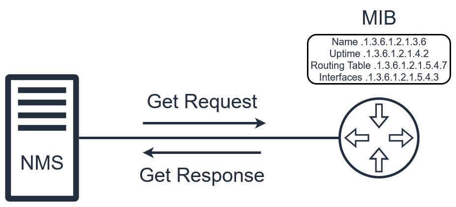
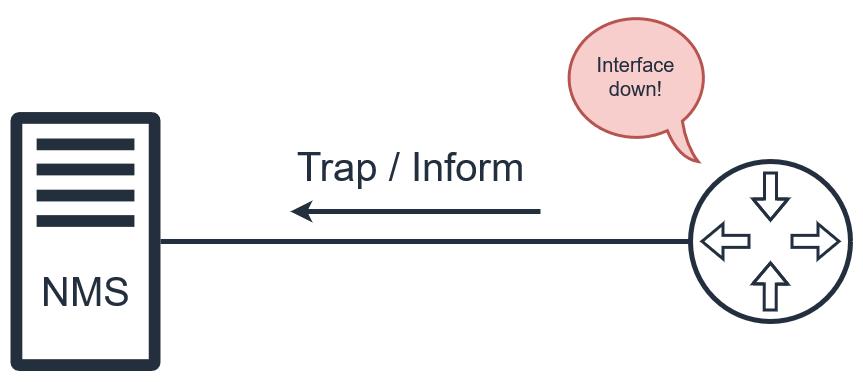

# Introduction
SNMP is a protocol which renders the service of providing monitoring of devices connected to a network. It can provide information such as online status, network bandwith, and even temperature.

This protocol works over UDP on port 161.

# Agents
Devices which are SNMP enabled are called *agents*. The monitored devices are known as *managed devices*, whilst the SNMP "server" is called the Network Management Station (NMS). The latter is responsible for gathering and organising the information it receives from the managed devices.

# Objects
Each agent has *objects*, some of which are standardised and others which are vendor specific. For example, a router might have name, uptime, interfaces, and routing table. Each object is assigned an *object identifier* (OID), which is a sequence of numbers separated by periods and resembling an IP address. OIDs are used for the identification of an object and are collectively stored in a Management Information Base (MIB) file.

# Management Information Base (MIB)
The MIB has follows a tree hierarchy and objects are organised in layers. Each layer is assigned a number and separated by a period in the OID, so in a sense, the OID is like a set of instructions how to get from the top of the tree to the desired object. Every agent is associated with a particular MIB.

# Communicating over SNMP
Three main ways of communication exist within SNMP:

1. The NMS can query the managed devices about their current status.
2. The NMS can order managed devices to alter aspects of their configuration.
3. Managed devices can send messages to the NMS when certain events occur, such as an interface going down.

## `Get` Requests
When the NMS wants to know about a specific object of an agent, it sends a `Get` request. These include `Get`, `GetNext`, and `GetBulk`. The agent then gives a `Get` response.

## `Set` Requests
`Set` requests are issued by the NMS, when it wants a certain agent to make a change to one of its objects.

## `Trap` and `Inform`
These are used by agents when they want to inform the NMS of something such as the occurrence of a critical event.

Although they serve the same purpose, `Trap` and `Inform` messages are different. The latter is reliable - it waits for acknowledgement from the NMS. Should it not receive one, the `Inform` message would be resent.

## Community strings
SNMP versions 1 and 2 avail themselves of the so-called *community strings*. It is important to know that agents reply to SNMP requests only if they are accompanied by the appropriate community string, which is akin to a password. Every community string is associated with a set of permissions. These can be either read-only or read-write.