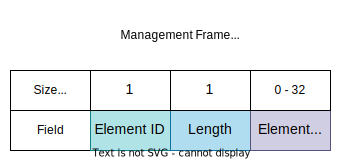
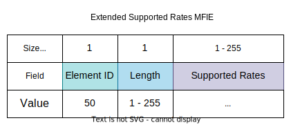

# Introduction
Management frames render the service of managing the Service Set. They have 3 addresses in their MAC header and are 24 bytes in size for 802.11a/b/g/, and 28 bytes for 802.11n (additional 4 bytes for the HT Control field). Their type in the [Frame Control](README.md#frame-control) is indicated by `00`. Moreover, management frames are never forwarded to the DS, so they have the `FromDS` and `ToDS` bits set to 0 in their Frame Control. 

The source and destination MAC addresses are self-explanatory. The third address is the BSS ID which can either be MAC of the AP or a wildcard value (for probe requests). If 802.11n is used, there is also an HT Control field in the MAC header. The frame body (payload) is comprised of fixed-size fields and variable-size information elements.

There are 12 subtypes of management frames:

|Subtype Bits|Meaning|
|:------------:|:----------:|
|`0000`|Association Request|
|`0001`|Association Response|
|`0010`|Reassociation Request|
|`0011`|Reassociation Response|
|`0100`|Probe Request|
|`0101`|Probe Response|
|`1000`|Beacon Frame|
|`1001`|Announcement Traffic Indication Message (ATIM)|
|`1010`|Disassociation Frame|
|`1011`|Authentication Frame|
|`1100`|Deauthentication Frame|
|`1101`|Action Frame|
|`1110`|Action - no ACK|

# Management Frame Fields
These are fixed-size fields and are typically located at the beginning of the management frame's body.

## Capability Information
This is a complex 2-byte field which indicates request or advertised capabilities. This field is present in beacon, probe response, association request, association response, reassociation request, and reassociation response frames.

The `ESS` & `IBSS` fields are mutually exclusive. The ESS bit indicates whether the frame is coming from an AP (1) or not (0) and the IBSS fields indicates whether or not the frame is coming form an IBSS station (1) or not (0).

The `Privacy` field is set to 1 if data confidentiality (AES, TKIP, or WEP) is required and is set to 0 otherwise. The encryption type is actually determined by the RSN field.

`Short Preamble` is set to 1 if short preambles are supported.

`Channel Agility` is an optional feature introduced by 802.11b. Its purpose was to reduce interference by periodically shifting the channel up and down a bit but it was never widely adopted.

`Spectrum Management` is set to 1 to reflect DFS and TPC support.

`QoS` is set to 1 if the AP supports QoS and is seto to 0 otherwise.

`Short Slot Time` is used to indicate whether Short Slot Time (9 μs) is used. This indicates that 802.11b is not supported by the AP, since this standard only uses Standard Slot Time (20 μs). If an 802.11b client joins the network, Short Slot Time should be disabled across the entire network until the 802.11b device leaves. Thus, all following frames should have this bit set to 0. For 802.11a, this bit is always set to 0, since Standard Slot Time is not supported, so there is no "long" and therefore no "short" time.

If the `APSD` set is set to 1, then the AP supports the eponymous feature. If this is set to 0, then the AP only supports Legacy Power Saving Mode. Frames originating from client should always have this bit set to 0, due to network-wide nature of this feature.

`DSSS-OFDM` provides 54 Mbps speeds in 802.11b/g-  
compatible networks. When this bit is set to 1, the DSSS-OFDM mode is allowed.  
When the bit is set to 0, this mode is not allowed. This bit is always set to 0 for 802.11a networks.

## Listen Interval
This 2-byte field is sent in Association and Reassociation Request in order to signal to the AP how often a station wakes up in order to listen to beacon management frames. Its value is in beacon interval units - a value of $n$ indicates that the station wakes up every $n$ beacons.

## Status Code Field
This is a 2-byte long field present in Response frames. If set to 0, then the request was successful. Otherwise, the field contains the failure code, where 1 indicates an unspecified failure.

## Reason Code Field
This 2-byte field is used to indicate the reason that an unsolicited notification man-  
agement frame of type disassociation, deauthentication, DELTS, DELBA, or DLS teardown  
was generated. It is only present in frames of the above types when such a frame is sent to a station without the client asking.

## Timestamp
This is an 8-byte long field which contains the number of μs that the AP has been active. It is used in [beacon](Discovery%20Frames.md#beacon-frames) and probe response frames. Stations avail themselves of this field in order to synchronise their clocks using a Time Synchronising Function (TSF). Should the timestamp exceed its maximum value, it will simply be reset to 0 and the counter would continue, although that would take 580 000 years.

## Beacon Interval
This 2-byte field represents the interval, in time units (1 TU = 1 kμs = 1 024 μs), between target beacon transmission times (TBTTs). It defaults to 100 TU but small changes may be allowed by certain drivers.

# Management Frame Information Elements
Manage frames can contain Management Frame Information Elements which are variable-length components and they may or may not be present. The typical structure of an MFIE is an element ID, followed by a length, and then the actual payload. The element ID and the length fields are both 1 bytes long, while the payload may range from 0 to 32 bytes. 

The following Element IDs are defined:

|Element ID|Name|
|:-----------:|:----:|
|0| Service Set Identity (SSID) |
|1| Supported Rates |
|2| FH Parameter Set |
|3| DS Parameter Set |
|4| CF Parameter Set |
|5| Traffic Indication Map (TIM) |
|6| IBSS Parameter Set |
|7| Country |
|8| Hopping Pattern Parameters |
|9| Hopping Pattern Table |
|10| Request |
|11 - 15| Reserved |
|16| Challenge Text |
|17 - 31| Reserved |
|32| Power Constraint |
|33| Power Capability |
|34| Transmit Power Control (TPC) Request |
|35| TPC Report |
|36| Supported Channels |
|37| Channel Switch Announcement |
|38| Measurement Request |
|39| Measurement Report |
|40| Quiet |
|41| IBSS DFS |
|42|ERP Information |
|43 - 47| Reserved |
|48| Robust Security Network (RSN) |
|49| Reserved |
|50| Extended Supported Rates |
|51 - 220| Reserved |
|221| WPA |
|222 - 255| Reserved |

## SSID
The SSID element is present in all beacons, probe requests, probe responses, association  
requests, and reassociation requests. It has an Element ID of 0. Its length is the length of the SSID string. The SSID string is encoded one character per byte and has a maximum length of 32.

## Supported Rates & Extended Supported Rates
This element is present in beacons, probe requests, probe responses, and all  
association frames. Its component is comprised of a maximum of 8 bytes where each byte describes a single supported rate. Each rate takes the following format in a byte. The last bit is set to 1 if the rate is basic (mandatory) and to 0 if there is simply support for it. The rest of the bits described the data rate in multiples of 500 Kbps. A station willing to join the network must support all the mandatory rates.

If there are more than 8 supported rates, then an Extender Rates Element is also present. This Element can describe up to 255 additional rates in the same fashion as the Supported Rates Element.

## Robust Security Network (RSN)
This element has an ID of 48. It is present in present in beacons, probe responses,  
association responses, and reassociation responses, and is utilised with WPA/2/3 in order to determine the authentication and encryption mechanism in use. RSN has several subfields and its length depends on the number of supported mechanisms.

The `Version` subfield is 2 bytes in length and always set to 1.

Next is the `Group Cipher Suite` descriptor. The first three bytes are an OUI of the vendor (`00:0F:AC` for 802.11) and the last byte is the suite type. Following is a table of the cipher suites.

|OUI|Suite Type|Description|
|:--:|:-----------:|:-----------:|
|`00:0F:AC`|0|Use the group cipher suite (for pairwise ciphers only).|
|`00:0F:AC`|1|WEP-40|
|`00:0F:AC`|2|TKIP|
|`00:0F:AC`|3|Reserved|
|`00:0F:AC`|4|CCMP-128|
|`00:0F:AC`|5|WEP-104|
|`00:0F:AC`|6|BIP-CMAC-128|
|`00:0F:AC`|7|Reserved|
|`00:0F:AC`|8|GCMP-128|
|`00:0F:AC`|9, 10|GCMP-256|
|`00:0F:AC`|11|BIP-GMAC-128|
|`00:0F:AC`|12, 13|BIP-GMAC-256|

Next is a 2-byte `Pairwise Cipher Suite Count` which indicates how many ciphers are in the next field. Each cipher is described by 4 bytes in the `Pairwise Cipher Suite List`.

The next two fields are similar to the Pairwise Cipher Suite fields, but describe the mechanisms supported for authentication (Authentication & Key Management). The `AKM Suite Count` defines the number of methods supported. Each method is described by 4 bytes in the `AKM Suite List`, where the first 3 bytes are again an OUI. 

|OUI|Suite Type|Authentication|
|:--:|:-----------:|:-----------:|
|`00:0F:AC`|1|802.1X or PMK Caching|
|`00:0F:AC`|2|Pre-shared Key (PSK)|
|Vendor OUI|Any|Vendor-specific|

The `RSN Capabilities` is a 2-byte field. The first 4 bits are flags and the rest must be set to 0. The `Preauthentication` bit is set by an AP to indicate that it supports preauthentication with other APs in order to move security sessions around. The `No Pairwise` bit is set station can support a manual WEP key for broadcast data in conjunction with a stronger unicast key, but this should not be used. 

The last two fields, `PMKID Count` and `PMKID List`, describe a list of PMKs which a client may send to an AP during association in order to speed up the process by bypassing time-consuming authentication. This only works if the AP caches PMKs. 
