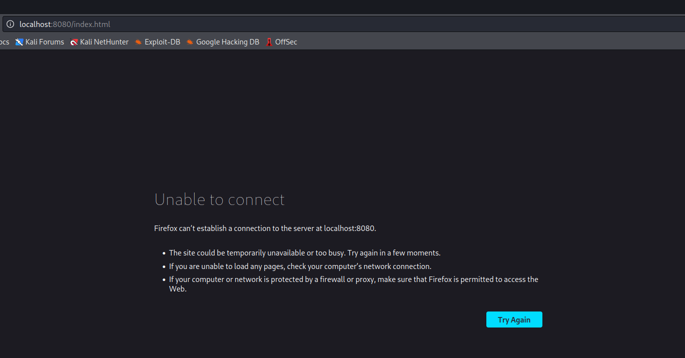
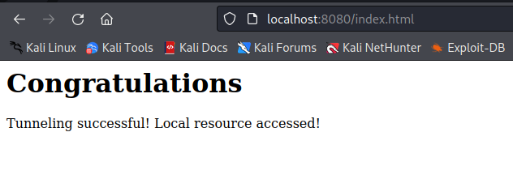

# Introduction
SSH Tunneling is a port forwarding technique which uses SSH. It can be used to access internal resources within a network if you have SSH access to a host inside it. Additionally, the tunnel goes through a pre-existing SSH connection and can thus be utilised for bypassing firewalls.

# Local Port Forwarding
Local port forwarding is used when you want to create a bridge to a port that hosts an internal service which does not accept connections from outside the network. For this to work, you need to specify two ports - one for the service on the remote machine which you want to access and one on your local machine to create the listener on. Any packets sent to your machine on the local port will be tunneled to the port on the remote machine through the SSH connection. Whilst you will still receive any responses to requests you send through the tunnel, you won't be able to receive arbitrary data that gets sent to the remote port.


The syntax is fairly simple:
```
ssh -L [LOCAL_IP:]LOCAL_PORT:DESTINATION:DESTINATION_PORT SSH_SERVER
```

- `[LOCAL_IP:]` - the interface you want to open the listener on. This can be omitted and defaults to `localhost`.
- `LOCAL_PORT` - the port you want to start the listener on. Any traffic sent to this port will be forwarded through the tunnel.
- `DESTINATION` - the destination host. This does not need to (and most likely won't) match `SSH_SERVER`, since you are now trying to access an internal resource.
- `DESTINATION_PORT` - the port on the remote machine, that you want to access through the tunnel.

You can also add `-N -f` to the above command, so that `ssh` runs in the background and only opens the tunnel without giving an interface for typing commands.


We have now established a tunnel on my Kali machine's port 8080, which will forward any traffic to `192.168.129.137:1337`, which is my ubuntu server. So let's see if we can access the web page.



Let's again check to see if we have access to the resource hidden behind `localhost:1337` on the Ubuntu server...



Wait, what? We just created the tunnel, but it does not seem to work? Well, remember how the `DESTINATION` does not need to match the server's IP? This is because the `DESTINATION` is where the traffic is sent *after* it gets to the remote machine. In a sense, the remote machine is now the sender and not us. Therefore, in order to access a resource internal to the network, we would need to change `DESTINATION` to something like `localhost` or another computer's IP.


# Remote Port Forwarding
Remote port forwarding is sort of the reverse of local port forwarding. A tunnel is opened and any traffic sent to the tunnel port on the remote machine will be forwarded to the local machin. In the exact same way as above, once the traffic is tunneled, the local machine becomes the sender. Therefore, remote port forwarding is more useful when you want to *receive* traffic from inside the network, rather than *injecting* it. You will be able to actively receive any data that is sent to the remote port, but you won't be able to send arbitrary data through the tunnel yourself.

The syntax is also very similar:

```
ssh -R [REMOTE:]REMOTE_PORT:DESTINATION:DESTINATION_PORT SSH_SERVER
```

- `[REMOTE:]` - the remote host to listen on. This resembles the `LOCAL_IP` when local port forwarding and can be omitted. If left empty, the remote machine will bind on all interfaces
- `REMOTE_PORT` - the port on the remote machine that is part of the tunnel.
- `DESTINATION:DESTINATION_PORT` - the host and port that the traffic should be sent to once it gets from the remote machine back to the local machine

Once again, you can add `-N -f` to the command, so that `ssh` runs in the background and only opens the tunnel without giving an interface for typing commands.
