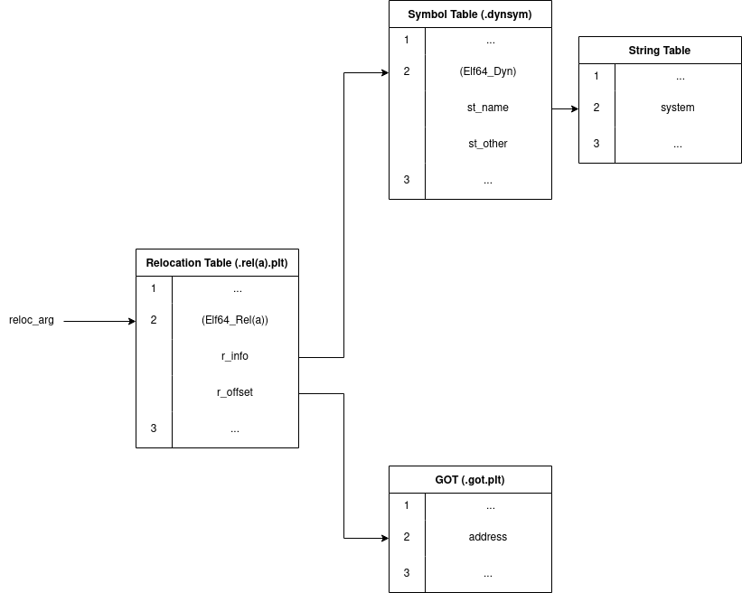

# Introduction
Dynamic linking permits the loading of libraries at runtime, which avoids their incorporation into the executable at compile time and, consequently, saves a drastic amount of disk space at the cost of significantly complicating the linking process. The dynamic linker has to go through the instructions and fix any calls to external functions after the required libraries have been mapped into the running executable. Additionally, the default behaviour is the so-called lazy loading - function addresses aren’t even resolved until the first time a procedure is invoked (although this can be overridden when compiling the executable).

When a function from a dynamic library is called, the call instruction always jumps to somewhere in the executable section of the ELF file called the Procedure Linking Table (PLT). All entries in this table are of a fixed length and each corresponds to a particular function. The initial element (PLT0) is a bit different in that it contains two instructions - the first one pushes the address of the link map (a structure containing a list of the shared libraries referenced by the executable) to the stack and the second instruction jumps to `_dl_resolve`, which takes two parameters - the link map and a relocation argument.


When a PLT entry, other than the first one, is executed, the programme first jumps to the address contained in the corresponding part of the Global Offset Table (GOT). When the function hasn’t been called before, this address will point to the next instruction in the respective PLT entry - in the case of `memcpy` this is the instruction at address 1036. This instruction pushes the offset from the beginning of the relocation table at which relocation information about this particular symbol is located. This is also the relocation argument we mentioned earlier. If the procedure has been previously invoked, its address will already be stored in the corresponding GOT entry and so the first instruction in the PLT entry will directly jump to the function at hand. The last instruction of every function’s PLT section just hands off execution to PLT0.

# The Relocation Table
The relocation table contains symbol relocation information in the form of an array of either `Elf32_Rel` or `Elf32_Rela` structures (for x32) and `Elf64_Rel` or `Elf64_Rela` (for x64). These are defined as follows:

```cpp
typedef struct {
        Elf32_Addr      r_offset;
        Elf32_Xword     r_info;
} Elf32_Rel;
 
typedef struct {
        Elf32_Addr      r_offset;
        Elf32_Xword     r_info;
        Elf32_Sxword    r_addend;
} Elf32_Rela;

typedef struct {
        Elf64_Addr      r_offset;
        Elf64_Xword     r_info;
} Elf64_Rel;
 
typedef struct {
        Elf64_Addr      r_offset;
        Elf64_Xword     r_info;
        Elf64_Sxword    r_addend;
} Elf64_Rela;

```

# The Dynamic Symbol Table
The dynamic symbol table (`.dynsym`) is an array of `Elf32_Sym` or `Elf64_Sym` structures (for x32 and x64, respectively) which are comprised of the following:

```cpp
typedef struct {
		Elf32_Word      st_name;
        Elf32_Addr      st_value;
        Elf32_Word      st_size;
        unsigned char   st_info;
        unsigned char   st_other;
        Elf32_Half      st_shndx;
} Elf32_Sym;

typedef struct {
        Elf64_Word      st_name;
        unsigned char   st_info;
        unsigned char   st_other;
        Elf64_Half      st_shndx;
        Elf64_Addr      st_value;
        Elf64_Xword     st_size;
} Elf64_Sym;
```

# `_dl_resolve`
When PLT0 hands off execution to `_dl_resolve`, the function will be called with the link map (pushed on the stack by PLT0) and the relocation argument (`reloc_arg`) which was pushed onto the stack by the respective PLT entry. You will notice that `_dl_resolve` takes its arguments directly from the stack. This is because once `_dl_resolve` finds the address of the requested symbol, it will invoke the procedure in addition to placing its address in the GOT. This means that we can still use the registers in order to provide arguments to the requested function.

## How `_dl_resolve` works
`_dl_resolve` on its own is a simple wrapper around several other functions. Initially, the relocation argument is used in order to locate the appropriate entry in the relocation table of the executable. The `r_info` member of this entry is then used to find the corresponding element in the dynamic symbol table. From there, `st_name` is utilised to pinpoint the location of the name of the function in the string table. Subsequently, `_dl_resolve` avails itself of this string in order to look it up in the code of the library. Once the address is found, `r_offset` is used to locate where in the GOT the address should be placed (note that despite its use, `r_offset` is actually an offset from the beginning of the ELF header). The function initially invoked is also called with any arguments which were provided to it. It bears a resemblance to the following:



